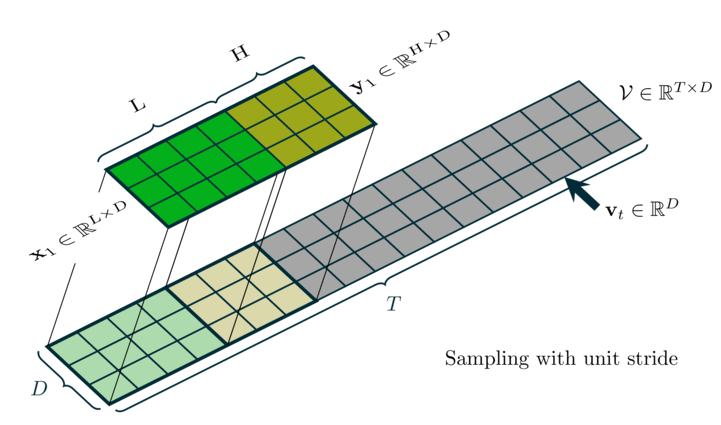
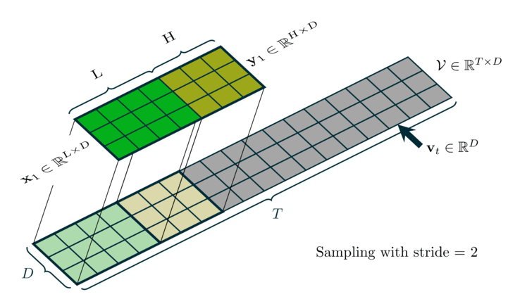

# Time Series Sliding-Window Sampling — Supplementary Material

This repository contains **dynamical visualizations** of sliding-window sampling for multivariate time series, as referenced in the paper. The animations illustrate how input windows (X) and target windows (Y) are extracted from a continuous sequence when building supervised pairs for sequence-to-sequence or forecasting models.

## Dynamical Visualizations

We provide two animated demonstrations (GIFs):

| Type | Description |
|------|-------------|
| **Unit-stride sampling** (stride = 1) | The window moves **one time step** at a time. Each frame shows one (X, Y) pair: X has length \(L\) (input context), Y has length \(H\) (target horizon), and they are adjacent along the time axis with no gap and no overlap. |
| **Strided sampling** (stride = 2) | The window advances by **two time steps** at a time. This reduces the total number of (X, Y) pairs and avoids highly overlapping windows. |

### Unit-stride sampling (stride = 1)

### Strided sampling (stride = 2)

In both animations:
- **X** and **Y** are highlighted in distinct colors to show the exact segments used as input and target for each pair.
- Frames correspond to consecutive (X, Y) pairs as the sliding window moves along the sequence.

These visualizations complement the paper's description of how unit-stride vs strided sliding-window sampling is defined and used in our experiments.

## Citation

If you use these visualizations or this code in your work, please cite the accompanying paper.
